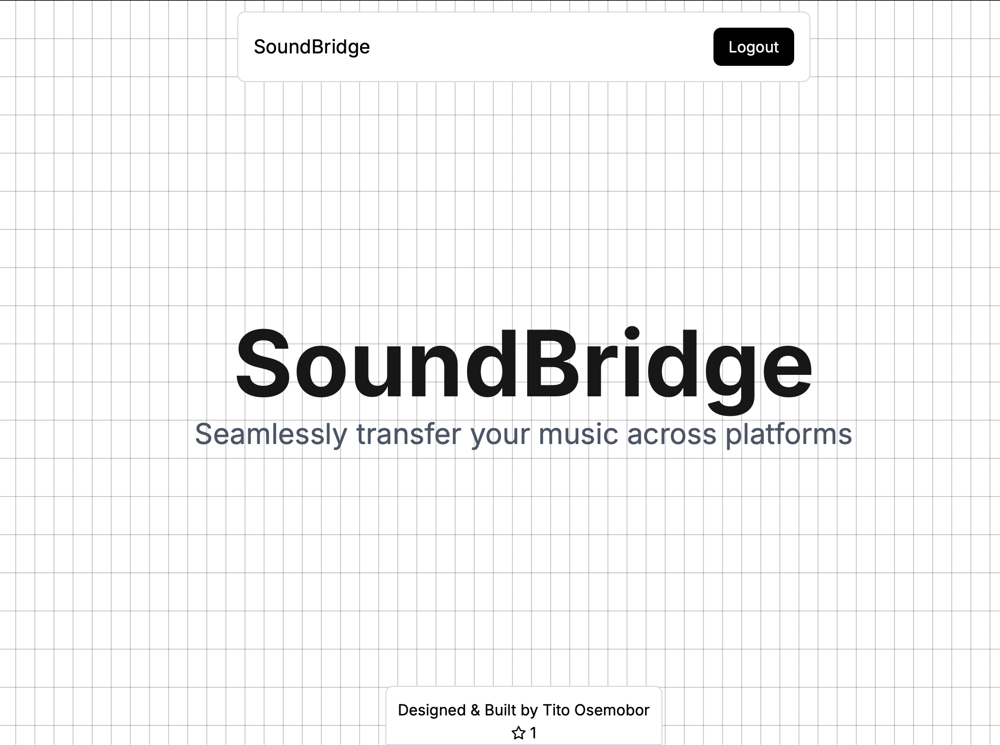

# 🎵 SoundBridge


## 📌 Overview
**SoundBridge** is a web application that allows users to **transfer playlists** between streaming services like **Spotify** and **YouTube Music**. Whether you're switching platforms or just syncing playlists, SoundBridge makes the process effortless.

## ✨ Features
✅ **Connect Multiple Streaming Services** (Spotify, YouTube Music, and more coming soon)
✅ **Fetch and Display Playlists** from supported platforms
✅ **Select and Transfer Playlists** seamlessly
✅ **Fuzzy Matching for Track Identification** (coming soon)
✅ **Secure OAuth Authentication**

## 🛠️ Tech Stack
### **Frontend**
- **Next.js (React)**
- **Tailwind CSS**
- **Axios (for API calls)**

### **Backend**
- **Node.js + Express.js**
- **Prisma ORM**
- **PostgreSQL (via Supabase)**
- **Spotify & YouTube Music API Integration**
- **OAuth Authentication + JWT Sessions**

---

## 🚀 **Getting Started**
### 1️⃣ **Clone the Repository**
```bash
git clone https://github.com/Tito-Osemobor/soundbridge.git
cd soundbridge
```

### 2️⃣ **Install Dependencies**
```bash
npm install
```

### 3️⃣ **Set Up Environment Variables**
Create a `.env` file in the backend root directory and add:
```env
SPOTIFY_CLIENT_ID=your_spotify_client_id
SPOTIFY_CLIENT_SECRET=your_spotify_client_secret
YOUTUBE_CLIENT_ID=your_youtube_client_id
YOUTUBE_CLIENT_SECRET=your_youtube_client_secret
DATABASE_URL=your_database_url
JWT_SECRET=your_jwt_secret
```

Create a `.env.local` file in the backend root directory and add:
```env
NEXT_PUBLIC_BACKEND_URL=http://localhost:8080
```

### 4️⃣ **Run the Project**
#### **Backend**
```bash
cd backend
npm start
```
#### **Frontend**
```bash
cd frontend
npm run dev
```

## 🤝 **Contributing**
I welcome contributions! Please follow these steps:
1. **Fork the repo** and create a new branch.
2. **Make your changes** and ensure everything works.
3. **Submit a pull request** with a clear description.

---

## 📜 **License**
This project is licensed under the **MIT License**.

---

🚀 **Now you're ready to transfer your playlists effortlessly with SoundBridge!** 🎶
For questions, open an issue or reach out.
